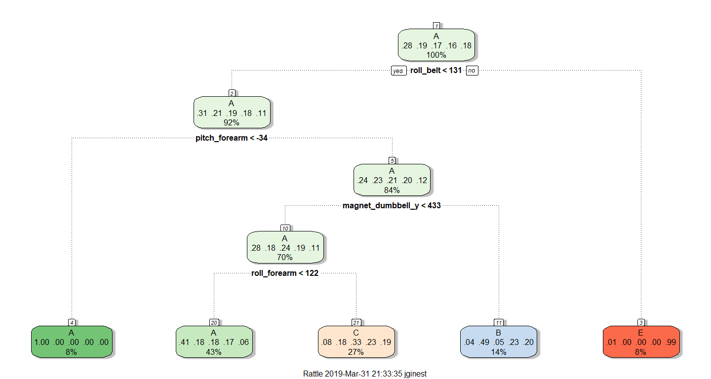
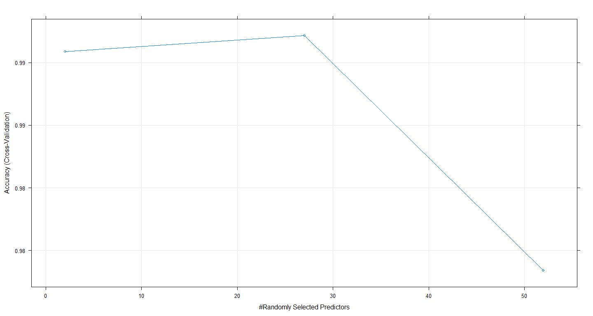

Practical Machine Learning - Week 4
================
Jessica Ginesta
March 31, 2019

Synopsis:
=========

Using devices such as Jawbone Up, Nike FuelBand, and Fitbit it is now possible to collect a large amount of data about personal activity relatively inexpensively. These type of devices are part of the quantified self movement - a group of enthusiasts who take measurements about themselves regularly to improve their health, to find patterns in their behavior, or because they are tech geeks. One thing that people regularly do is quantify how much of a particular activity they do, but they rarely quantify how well they do it. In this project, your goal will be to use data from accelerometers on the belt, forearm, arm, and dumbell of 6 participants. They were asked to perform barbell lifts correctly and incorrectly in 5 different ways. More information is available from the website here: <http://groupware.les.inf.puc-rio.br/har>

The goal of this project is to predict the manner in which the participants did the exercise.

From our results, we can say that the wight lifting exercises are being performed correctly.

Data Processing
---------------

Let's start by downloading and extracting only the fields we will use for this analysis. We have followed a couple of steps to make our data cleaner. - We will remove poor predictors from our data by identifying which ones have zero variance. - We will remove the variables that have NA's. - We will remove the variables that are identifiers and timestamps and are not sensor measurements.

``` r
#Load dataset
training <- read.csv(url("https://d396qusza40orc.cloudfront.net/predmachlearn/pml-training.csv"),header=TRUE)

testing <- read.csv(url("https://d396qusza40orc.cloudfront.net/predmachlearn/pml-testing.csv"),header=TRUE)

#Cleaning data
# Remove variables that don't make intuitive sense for prediction which are the first 7.
trainClean<- training[, colSums(is.na(training)) == 0]
trainClean<-trainClean[,-c(1:7)]
testClean <- testing[, colSums(is.na(testing)) == 0]
testClean<-testClean[,-c(1:7)]

# Create a partition with the training dataset 
inTrain <- createDataPartition(trainClean$classe, p = 0.7, list = FALSE)
TrainSet <- trainClean[inTrain, ]
TestSet <- trainClean[-inTrain, ]

zeroVar <- nearZeroVar(TrainSet)
TrainSet <- TrainSet[, -zeroVar]
TestSet  <- TestSet[,-zeroVar]
dim(TrainSet)
dim(TestSet)
```

Initially loading the data, the testing dataset had 20 observations with 160 variables and the training set had 19622 observations with 160 observations. Looking at the data there were many variables that had NA values in most of their observations. We also removed the first 7 columns as it is personal data and would interfere in the predictions.

After creatinga partition with the test and training set we have: - New Training Set: 13737 observations with 53 variables. - New Testing Set: 5885 observations with 53 variables.

### Analyzing Data

We will run our test and train data through a couple of models to obtain the best accuracy. Cross validation is being used with k-folds=5, as 10 is more resource intesive and doesn't not improve accuracy that much. We will start by setting the seed to allow a reproducible research.

``` r
set.seed(1111)

# Fit classification tess as a model
# <- trainControl(method="cv", number=5)
trControl <- trainControl(method="cv", number=5,allowParallel = TRUE)
modFit <- train(classe ~ .,method="rpart",data=na.omit(TrainSet),trControl=trControl)

# Print the classification tree
fancyRpartPlot(modFit$finalModel)
```



``` r
predTree <- predict(modFit,newdata=TestSet)
tableTree <- confusionMatrix(TestSet$classe,predTree)
tableTree
```

    ## Confusion Matrix and Statistics
    ## 
    ##           Reference
    ## Prediction    A    B    C    D    E
    ##          A 1513   33  125    0    3
    ##          B  461  404  274    0    0
    ##          C  479   30  517    0    0
    ##          D  419  177  368    0    0
    ##          E  154  139  268    0  521
    ## 
    ## Overall Statistics
    ##                                         
    ##                Accuracy : 0.502         
    ##                  95% CI : (0.489, 0.515)
    ##     No Information Rate : 0.514         
    ##     P-Value [Acc > NIR] : 0.969         
    ##                                         
    ##                   Kappa : 0.35          
    ##  Mcnemar's Test P-Value : NA            
    ## 
    ## Statistics by Class:
    ## 
    ##                      Class: A Class: B Class: C Class: D Class: E
    ## Sensitivity             0.500   0.5160   0.3331       NA   0.9943
    ## Specificity             0.944   0.8559   0.8825    0.836   0.8954
    ## Pos Pred Value          0.904   0.3547   0.5039       NA   0.4815
    ## Neg Pred Value          0.641   0.9201   0.7870       NA   0.9994
    ## Prevalence              0.514   0.1331   0.2637    0.000   0.0890
    ## Detection Rate          0.257   0.0686   0.0879    0.000   0.0885
    ## Detection Prevalence    0.284   0.1935   0.1743    0.164   0.1839
    ## Balanced Accuracy       0.722   0.6860   0.6078       NA   0.9448

``` r
accuracyTree<-tableTree$overall[1]
accuracyTree
```

    ## Accuracy 
    ##      0.5

The accuracy of the Tree is 0.5 which is not very good. Our next step will be trying the random forest.

### Random Forest

We will now fit the model on modelRandomF, and instruct the "train" function to use 3-fold cross-validation to select optimal tuning parameters for the model.

``` r
rfControl <- trainControl(method="cv", number=3,verboseIter=F,allowParallel = TRUE)

modelRandomF <- train(classe~., data=na.omit(TrainSet), method="rf", trControl=rfControl)
print(modelRandomF)
```

    ## Random Forest 
    ## 
    ## 13737 samples
    ##    52 predictor
    ##     5 classes: 'A', 'B', 'C', 'D', 'E' 
    ## 
    ## No pre-processing
    ## Resampling: Cross-Validated (3 fold) 
    ## Summary of sample sizes: 9158, 9158, 9158 
    ## Resampling results across tuning parameters:
    ## 
    ##   mtry  Accuracy  Kappa
    ##    2    0.99      0.99 
    ##   27    0.99      0.99 
    ##   52    0.98      0.98 
    ## 
    ## Accuracy was used to select the optimal model using the largest value.
    ## The final value used for the model was mtry = 27.

``` r
# Print the accuracy
predRandomF <- predict(modelRandomF,newdata=TestSet)
tableRandomF <- confusionMatrix(TestSet$classe,predRandomF)
tableRandomF
```

    ## Confusion Matrix and Statistics
    ## 
    ##           Reference
    ## Prediction    A    B    C    D    E
    ##          A 1672    0    2    0    0
    ##          B    5 1128    6    0    0
    ##          C    0    2 1022    2    0
    ##          D    0    0   10  952    2
    ##          E    0    0    1    5 1076
    ## 
    ## Overall Statistics
    ##                                         
    ##                Accuracy : 0.994         
    ##                  95% CI : (0.992, 0.996)
    ##     No Information Rate : 0.285         
    ##     P-Value [Acc > NIR] : <2e-16        
    ##                                         
    ##                   Kappa : 0.992         
    ##  Mcnemar's Test P-Value : NA            
    ## 
    ## Statistics by Class:
    ## 
    ##                      Class: A Class: B Class: C Class: D Class: E
    ## Sensitivity             0.997    0.998    0.982    0.993    0.998
    ## Specificity             1.000    0.998    0.999    0.998    0.999
    ## Pos Pred Value          0.999    0.990    0.996    0.988    0.994
    ## Neg Pred Value          0.999    1.000    0.996    0.999    1.000
    ## Prevalence              0.285    0.192    0.177    0.163    0.183
    ## Detection Rate          0.284    0.192    0.174    0.162    0.183
    ## Detection Prevalence    0.284    0.194    0.174    0.164    0.184
    ## Balanced Accuracy       0.998    0.998    0.990    0.995    0.998

``` r
accuracyRandomF<-tableRandomF$overall[1]
accuracyRandomF
```

    ## Accuracy 
    ##     0.99

``` r
plot(modelRandomF)
```

 The accuracy of the random Forest is 0.99 which is great. Our next step will be trying to predict with the random forest model the Test data. The sample error rate is 0.01.

Conclusion
----------

Based on the accuracies above, the random forest model is the best one. We will now predict the values to use in the 20 questions test.

``` r
finalTest<-predict(modelRandomF,newdata=testClean)
finalTest
```

    ##  [1] B A B A A E D B A A B C B A E E A B B B
    ## Levels: A B C D E
